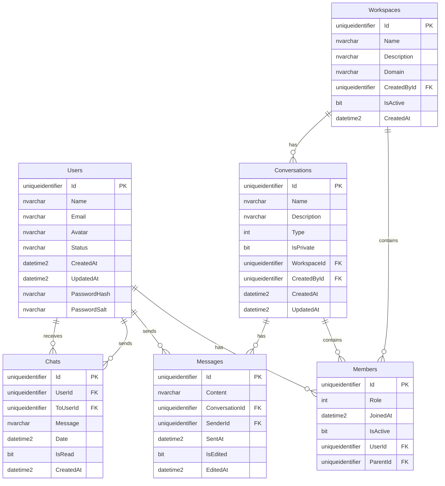

# 🎨 ChatTask Görsel Veritabanı Rehberi

Bu rehber, ChatTask projesindeki veritabanı tablolarını görsel olarak görüntüleme yöntemlerini açıklar.

## 🌐 Web Tabanlı Görsel Arayüzler

### **1. Adminer (Web Tabanlı)**

Adminer, web tabanlı bir veritabanı yönetim aracıdır. Docker ile çalıştırılabilir.

#### Kurulum:
```bash
# Docker Compose'a Adminer ekleyin (docker-compose.yml'de zaten eklendi)
docker-compose up -d adminer
```

#### Erişim:
- **URL**: http://localhost:8080
- **Server**: sqlserver
- **Username**: sa
- **Password**: YourStrong@Passw0rd
- **Database**: ChatTask_UserService veya ChatTask_ChatService

#### Özellikler:
- 📊 Tablo yapılarını görsel olarak görüntüleme
- 🔍 Veri sorgulama ve düzenleme
- 📈 İstatistikler ve raporlar
- 🎨 Renkli tablo görünümleri

### **2. SQL Server Management Studio (SSMS)**

En profesyonel ve görsel yöntem.

#### Kurulum:
1. [SSMS İndir](https://aka.ms/ssmsfullsetup)
2. Kurulumu tamamlayın

#### Bağlantı:
- **Server**: localhost,1433
- **Authentication**: SQL Server Authentication
- **Login**: sa
- **Password**: YourStrong@Passw0rd
- **Trust server certificate**: ✅

#### Görsel Özellikler:
- 🗂️ Object Explorer ile tablo navigasyonu
- 📋 Tablo tasarımcısı (Table Designer)
- 🔗 İlişki diyagramları (Database Diagrams)
- 📊 Query sonuçlarını grid olarak görüntüleme

## 📊 Entity Relationship (ER) Diagramları

### **ChatTask Veritabanı Yapısı**



## 🎨 Görsel Tablo Yapıları

### **ChatTask_UserService.Users**
```
┌─────────────────────────────────────────────────────────────┐
│                        Users Table                         │
├─────────────────┬─────────────┬─────────┬──────────────────┤
│ Column          │ Type        │ Null    │ Max Length       │
├─────────────────┼─────────────┼─────────┼──────────────────┤
│ 🔑 Id           │ uniqueid    │ NO      │ -                │
│ 👤 Name         │ nvarchar    │ NO      │ 100              │
│ 📧 Email        │ nvarchar    │ NO      │ 255              │
│ 🖼️ Avatar       │ nvarchar    │ NO      │ 500              │
│ 🟢 Status       │ nvarchar    │ NO      │ 20               │
│ 📅 CreatedAt    │ datetime2   │ NO      │ -                │
│ 🔄 UpdatedAt    │ datetime2   │ NO      │ -                │
│ 🔐 PasswordHash │ nvarchar    │ NO      │ -1               │
│ 🧂 PasswordSalt │ nvarchar    │ NO      │ -1               │
└─────────────────┴─────────────┴─────────┴──────────────────┘
```

### **ChatTask_ChatService.Chats**
```
┌─────────────────────────────────────────────────────────────┐
│                        Chats Table                         │
├─────────────────┬─────────────┬─────────┬──────────────────┤
│ Column          │ Type        │ Null    │ Max Length       │
├─────────────────┼─────────────┼─────────┼──────────────────┤
│ 🔑 Id           │ uniqueid    │ NO      │ -                │
│ 👤 UserId       │ uniqueid    │ NO      │ -                │
│ 👥 ToUserId     │ uniqueid    │ NO      │ -                │
│ 💬 Message      │ nvarchar    │ NO      │ 1000             │
│ 📅 Date         │ datetime2   │ NO      │ -                │
│ ✅ IsRead       │ bit         │ NO      │ -                │
│ 📅 CreatedAt    │ datetime2   │ NO      │ -                │
└─────────────────┴─────────────┴─────────┴──────────────────┘
```

## 🔧 Görsel Veritabanı Araçları

### **1. DBeaver (Ücretsiz)**
- **İndirme**: https://dbeaver.io/download/
- **Özellikler**: 
  - 🎨 ER diagramları
  - 📊 Görsel sorgu editörü
  - 🔗 İlişki görüntüleme
  - 📈 İstatistik grafikleri

### **2. DataGrip (JetBrains)**
- **İndirme**: https://www.jetbrains.com/datagrip/
- **Özellikler**:
  - 🎯 Akıllı kod tamamlama
  - 📊 Görsel sorgu sonuçları
  - 🔗 Veritabanı şema görüntüleme

### **3. Azure Data Studio**
- **İndirme**: https://docs.microsoft.com/en-us/sql/azure-data-studio/download-azure-data-studio
- **Özellikler**:
  - 📊 Notebook desteği
  - 🎨 Temalar
  - 🔗 Extensions

## 📱 Mobil Görüntüleme

### **SQL Server Mobile Apps**
- **SQL Server Management Studio Mobile**
- **Azure Data Studio** (Cross-platform)

## 🎯 Hızlı Başlangıç

### **En Hızlı Görsel Yöntem:**

1. **SSMS İndirin**: https://aka.ms/ssmsfullsetup
2. **Bağlanın**:
   - Server: `localhost,1433`
   - Login: `sa`
   - Password: `YourStrong@Passw0rd`
3. **Object Explorer'da**:
   - Databases → ChatTask_UserService → Tables
   - Databases → ChatTask_ChatService → Tables
4. **Tablo Tasarımcısını Açın**:
   - Sağ tık → Design
   - Tablo yapısını görsel olarak görün

### **Web Tabanlı Hızlı Yöntem:**

1. **Adminer'ı Başlatın**:
   ```bash
   docker-compose up -d adminer
   ```
2. **Tarayıcıda Açın**: http://localhost:8080
3. **Bağlanın**:
   - Server: `sqlserver`
   - Username: `sa`
   - Password: `YourStrong@Passw0rd`
4. **Veritabanını Seçin**: ChatTask_UserService veya ChatTask_ChatService

## 🎨 Görsel Özellikler

### **SSMS'de Görsel Özellikler:**
- 🗂️ **Object Explorer**: Sol panelde tablo listesi
- 📋 **Table Designer**: Tablo yapısını düzenleme
- 🔗 **Database Diagrams**: ER diagramları
- 📊 **Query Results**: Grid görünümü
- 🎨 **Syntax Highlighting**: Renkli SQL kodları

### **Adminer'da Görsel Özellikler:**
- 🌐 **Web Interface**: Tarayıcı tabanlı
- 📊 **Table View**: Tablo verilerini grid olarak
- 🔍 **Search**: Hızlı veri arama
- 📈 **Statistics**: Tablo istatistikleri
- 🎨 **Themes**: Farklı renk temaları

---

**💡 İpucu**: En görsel deneyim için SSMS kullanın, hızlı erişim için Adminer'ı tercih edin!
